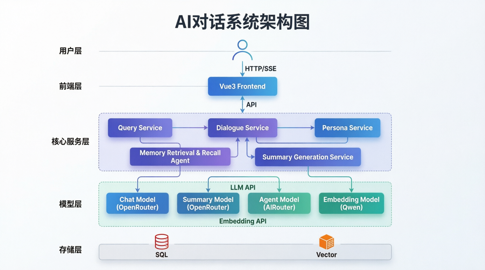
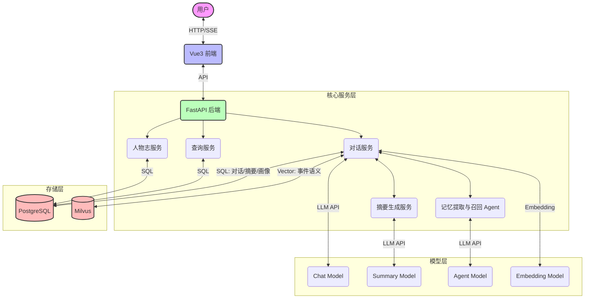

# 记忆对话系统 (Memory Chat System)

一个通过多 AI 协同工作的智能对话系统，具备长期记忆、事件提取和系统日志查询能力。系统能够自然地与用户对话，在后台自动提取事件、摘要内容并向量化存储，从而在后续对话中实现长期的记忆召回与结合。

## 系统架构





## 技术栈

- **后端**: Python, FastAPI
- **数据库**: PostgreSQL (关系型数据), Milvus (向量存储)
- **大语言模型**: 第三方模型 API (例如 Minimax, Stepfun)
- **前端**: Vue 3, Vite, TypeScript

## 核心功能

- **上下文感知对话**: 系统会根据之前的对话内容和事件自动检索相关记忆。
- **自动事件摘要**: 在多轮对话结束后，系统会自动将其归档为一个“事件”，生成摘要并存储。
- **动态记忆召回**: 利用 Milvus 向量引擎，提取当前聊天的语义信息，从历史事件中寻找相关记忆片段。
- **人物画像管理**: 维护特定人物的关系图谱、爱好、个人信息，便于丰富对话上下文。

## 目录结构

```text
.
├── api/                  # FastAPI 路由模块（聊天、人物志、查询监控等）
├── database/             # 数据库客户端（PostgreSQL、Milvus 相关操作）
├── prompts/              # 系统级提示词存放处 (Markdown 格式)
├── services/             # 核心服务逻辑 (聊天对话、记忆提取、嵌入生成)
├── utils/                # 辅助工具类 (Token 计算等)
├── web/                  # 前端 Vue3 项目
├── config.py             # 读取并管理所有中心化配置
├── main.py               # 后端服务入口
├── requirements.txt      # Python 依赖
└── .env                  # 系统配置文件
```

## 快速启动

1. 在项目根目录下创建/配置 `.env` 文件。
2. 安装依赖：`pip install -r requirements.txt`
3. 启动后端服务：`python main.py`（默认运行在 8000 端口）。
4. 进入前端目录 `cd web`，安装依赖 `npm install`。
5. 启动前端服务：`npm run dev`。
