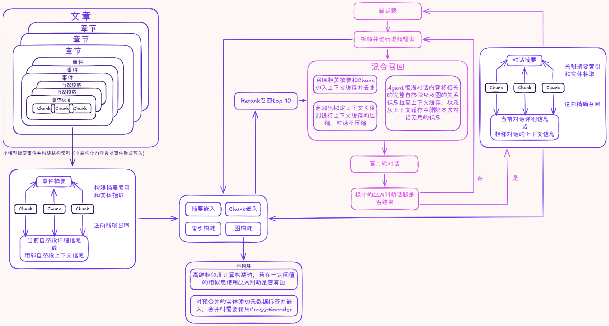

# Synapse Memory

> 独立的 AI 记忆检索系统 —— 为任意 LLM / Agent 提供结构化长期记忆能力



## 概述

Synapse Memory 是一个**独立部署的记忆服务**，通过 REST API 对外提供结构化的记忆检索能力。系统将非结构化文本（文章、对话）切分为 Chunk，构建摘要索引 + 向量索引 + 知识图谱的多路存储，并通过混合召回 + Rerank 实现高质量的对话记忆检索。

**核心特性：**
- 🔌 **即插即用** — 通过 `submit_turn` 接口接入，不侵入外部 LLM 逻辑
- 🧠 **结构化记忆包** — 返回原文 Chunk、摘要、知识图谱关系，使用者自行决定如何使用
- 🔍 **两层检索** — 基础重写检索（默认）+ Agent 增强检索（可选，≤5 轮迭代）
- 📊 **话题感知** — 自动检测话题切换，异步归档生成摘要和图谱
- ⚙️ **全可配置** — 所有检索参数均可由使用者按需调整，不设硬上限

## 技术栈

| 组件 | 技术 |
|------|------|
| **后端框架** | Python, FastAPI |
| **关系存储** | PostgreSQL — Chunk 原文、文档结构、摘要 |
| **向量存储** | Milvus (Zilliz Cloud) — 摘要向量 + Chunk 向量双集合 |
| **知识图谱** | Neo4j — 实体关系、L1 子图查询 |
| **全文检索** | Elasticsearch (可选备用) |
| **LLM** | OpenAI 兼容接口（Qwen3 等） |
| **Embedding** | 1024 维 Embedding 模型 |
| **Rerank** | Cross-Encoder 精排模型 |

## 快速开始

### 1. 安装依赖

```bash
pip install -r requirements.txt
```

### 2. 配置环境变量

```bash
cp .env.example .env
# 编辑 .env，填入实际的数据库连接和 API 密钥
```

### 3. 启动服务

```bash
# 启动独立记忆 API 服务
python -m api.memory_api

# 或使用 uvicorn
uvicorn api.memory_api:app --host 0.0.0.0 --port 8000
```

### 4. 接入使用

```python
from sdk.synapse_client import SynapseClient

async with SynapseClient("http://localhost:8000") as client:
    # 提交一轮对话，获取记忆包
    result = await client.submit_turn(
        session_id="my_session",
        user_message="红楼梦里的贾宝玉是什么样的人？",
        assistant_response="贾宝玉是主人公，性格风流多情。",
    )

    # 使用返回的记忆包
    print(f"相关 Chunk: {len(result.ranked_chunks)}")
    print(f"相关摘要: {len(result.ranked_summaries)}")
    print(f"话题切换: {result.topic_changed}")
```

更多示例参见 [`sdk/example_usage.py`](sdk/example_usage.py)。

## 核心 API

### `POST /submit_turn` — 核心交互

提交一轮对话，返回结构化记忆包（MemoryPackage）。

```json
{
  "session_id": "session_001",
  "user_message": "用户消息",
  "assistant_response": "助手回复",
  "max_chunks": 10,
  "max_summaries": 5,
  "min_similarity": 0.5,
  "enable_adjacent_chunks": false
}
```

**返回**：`ranked_chunks`、`ranked_summaries`、`graph_context`、`extra_chunk_ids`、`topic_changed`、`topic_id`、`pending_archive_summary`、`token_estimate`、`usage`

### `POST /ingest_document` — 文档摄入

将文档切分为 Chunk，建立向量索引和知识图谱。

### `GET /session/{session_id}` — Session 状态

### `POST /chunks/by_ids` — 按 ID 批量拉取 Chunk

### `GET /chunks/{chunk_id}/adjacent` — 逆向召回

### `DELETE /topic/{topic_id}` — 删除话题

完整 API 文档：启动服务后访问 `http://localhost:8000/docs`

## 目录结构

```text
.
├── api/                  # REST API 层
│   ├── memory_api.py     # 独立记忆服务 API（submit_turn 等）
│   ├── chat.py           # 对话服务 API
│   └── query.py          # 查询监控 API
├── database/             # 数据库客户端
│   ├── pg_client.py      # PostgreSQL 客户端
│   ├── milvus_client.py  # Milvus 向量数据库（双集合）
│   ├── es_client.py      # Elasticsearch（可选）
│   ├── neo4j_client.py   # Neo4j 知识图谱
│   └── models.py         # 数据模型定义
├── services/             # 核心服务逻辑
│   ├── memory_service.py # 记忆服务核心（submit_turn 实现）
│   ├── memory_package.py # MemoryPackage + RetrievalConfig 定义
│   ├── session_manager.py# Session 管理 + 临时缓存
│   ├── hybrid_retrieval.py# 混合检索（RRF 融合）
│   ├── query_rewriter.py # 查询拆解与重写
│   ├── rerank_service.py # Rerank 精排
│   ├── memory_agent.py   # 记忆检索 Agent
│   ├── kg_manager.py     # 知识图谱管理
│   ├── document_processor.py # 文档切分
│   ├── ingestion_pipeline.py # 摄入管道
│   ├── embedding_service.py  # Embedding 服务
│   ├── llm_client.py     # LLM 调用封装
│   └── summary_service.py# 摘要生成
├── sdk/                  # Python SDK
│   ├── synapse_client.py # 客户端封装
│   └── example_usage.py  # 使用示例
├── prompts/              # 系统提示词（Markdown）
├── docs/                 # 设计文档
├── images/               # 架构图等图片资源
├── tests/                # 测试
├── config.py             # 配置管理
├── main.py               # 服务入口
├── requirements.txt      # Python 依赖
└── .env.example          # 环境变量模板
```

## 检索架构

```
用户消息 → QueryRewriter 拆解多条查询
  → Milvus 并行检索（向量 + 关键词双通道）
  → RRF 融合 → Rerank → Top K

  [可选] Agent 增强层
  → 基于基础层结果 + 用户问题焦点
  → Agent 自主调用工具（补充检索 / 逆向召回 / 图谱追踪）
  → 最多 5 轮迭代 → 去重合并
```

## 配置说明

所有配置通过 `.env` 文件管理，参见 [`.env.example`](.env.example)。

关键配置项：
- `LLM_VERIFY_SSL` — SSL 验证开关（生产环境建议设为 `true`）
- `EMBEDDING_DIM` — Embedding 维度（默认 1024）
- `MAX_MEMORY_TOKENS` — 记忆检索的 token 预算

## Roadmap

> 当前版本已实现核心检索闭环，以下为后续优化方向。

### 🚀 话题 / 事件处理速度

| 优化项 | 现状 | 目标 |
|--------|------|------|
| **异步归档并行化** | 归档时串行执行摘要生成 → Chunk 索引 → 图谱更新 | 将摘要生成、Embedding 入库、三元组抽取改为 `asyncio.gather` 全并行执行 |
| **Embedding 批量化** | 归档时逐条 Chunk 向量化 | 合并为单次批量 [embed_texts](file:///c:/Users/chenchen/.openclaw/workspace/synapse_memory/services/embedding_service.py#57-88) 调用，减少 HTTP 往返 |
| **三元组抽取批处理** | 每个 Chunk 独立调用一次 LLM | 合并相邻 Chunk 上下文后批量提交，减少 LLM 调用次数，加入实体注释提高实体合并精度 |
| **Session 持久化** | 内存 Dict + threading.Lock，重启丢失 | 引入 Redis 作为 Session 缓存层，支持多实例水平扩展 |

### 🎯 Agent 召回精度

| 优化项 | 现状 | 目标 |
|--------|------|------|
| **查询重写质量** | 单轮 LLM 重写，生成 ≤3 条子查询 | 引入 Chain-of-Thought 提示策略，支持意图识别 + 多粒度查询生成 |
| **图谱辅助召回** | 实体提取为占位逻辑，图谱上下文利用率低 | 强化 NER 抽取流程，通过图谱关系做关联扩展召回（A→B→C 二跳追踪） |
| **Rerank 模型升级** | 使用轻量 Cross-Encoder (0.6B) | 支持可配置的 Rerank 模型切换，评估更高精度模型对端到端效果的提升 |
| **动态相似度阈值** | 固定 `min_similarity=0.5` | 根据查询类型和候选集分布动态调整阈值，减少噪声 Chunk |
| **逆向召回上下文窗口** | 按 `section_index` 固定窗口 ±N | 支持跨章节的段落级精细定位（`section_index + paragraph_index` 联合定位） |
| **去重策略** | 基于 `chunk_id` 精确去重 | 引入语义去重（MinHash / SimHash），过滤内容高度重叠的 Chunk |

### ⏱️ Agent 召回延迟

| 优化项 | 现状 | 目标 |
|--------|------|------|
| **检索与 Rerank 流水线化** | 检索 → 等待全部完成 → Rerank（串行） | 流式处理，边出结果边送入 Rerank，减少等待时间 |
| **Embedding 缓存** | 每次查询都重新生成 query embedding | 引入 LRU 缓存层，相同/相似 query 直接命中 |
| **多查询并行检索** | 重写后的子查询串行处理 | `asyncio.gather` 并行检索所有子查询的 Chunk + Summary |
| **Milvus 连接池** | 每次请求独立创建连接 | 引入连接池，减少连接建立开销 |
| **Agent 迭代的早停机制** | 固定最多 5 轮 | 基于增量信息增益判断——若新一轮补充召回没有显著新增内容，提前终止 |
| **超时与降级** | 无全局超时控制 | 为 Agent 增强层设置超时阈值，超时自动降级为基础检索结果返回 |

### 📦 数据摄入优化

| 优化项 | 现状 | 目标 |
|--------|------|------|
| **增量摄入** | 每次全量重新处理 | 支持 `doc_id` 级别的增量更新，仅重新处理变更部分 |
| **大文档流式切分** | 全文加载到内存 | 支持流式读取，降低大文档的内存峰值 |
| **摘要向量批量入库** | 逐条摘要调 Embedding + Milvus | 合并为批量操作 |

### 🔧 工程化 & 可观测性

| 优化项 | 说明 |
|--------|------|
| **结构化日志** | 统一 JSON 日志格式，增加 `request_id` 贯穿全链路追踪 |
| **性能指标采集** | 接入 Prometheus，暴露检索延迟、Rerank 耗时、归档队列深度等 Metrics |
| **健康检查增强** | 当前 `/` 返回固定 OK，改为真实检测各依赖服务（PG / Milvus / Neo4j）连通性 |
| **配置热更新** | 当前配置启动时加载一次，后续支持 `RetrievalConfig` 的运行时动态调整 |
| **API 鉴权** | 增加 API Key / JWT 鉴权中间件，支持多租户隔离 |
| **限流与熔断** | 对 LLM / Embedding 等外部依赖增加限流保护和熔断降级 |
| **Docker 部署** | 提供 `Dockerfile` + `docker-compose.yml`，一键拉起全栈依赖 |
| **K8s 生产部署** | 提供 Helm Chart / K8s Manifests，支持 HPA 自动扩缩容、配置与密钥管理（ConfigMap/Secret），实现滚动更新与高可用部署（待实践学习） |

## License

[MIT](LICENSE)
