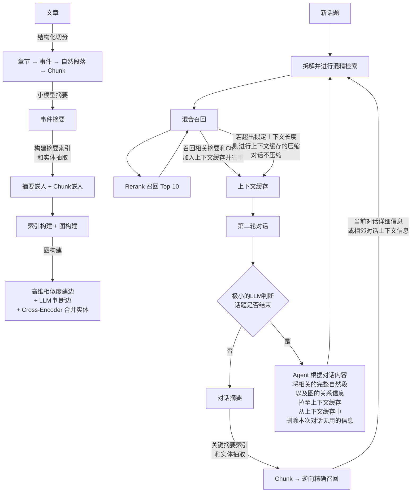

# My Memory 系统重构 — MVP 开发计划

## 1. 背景与目标

基于架构图设计的「个人记忆系统」，目标是：**将非结构化文本（文章、对话）切分为 Chunk，构建摘要索引 + 向量索引 + 知识图谱的多路存储，并通过混合召回 + Rerank + Agent 上下文管理实现高质量的对话记忆检索与延续。**

### 现有资源盘点

| 资源 | 现状 | 架构图中的角色 |
|------|------|----------------|
| **Milvus** | ✅ 已接入（Zilliz Cloud），存 event 级 summary 向量 | → 存 Chunk 向量 + 摘要向量 |
| **PostgreSQL** | ✅ 可用，尚未接入 | → 存 Chunk 原文 + 元数据（倒排索引）+ 文档/摘要结构化数据 |
| **NebulaGraph** | ✅ 可用，尚未接入 | → 替代 Neo4j，存实体-关系图谱 |
| **Elasticsearch** | ✅ 可用，尚未接入 | → 全文检索（替代目前 Milvus Scalar Filter） |
| **LLM（测试模型）** | ✅ 已有 Ollama Qwen3-30B-A3B | → 摘要生成 / 实体抽取 / 话题判断 / 检索参数决策 / Agent 决策 |
| **Embedding 模型** | ✅ 1024 维 | → Chunk 向量嵌入 + 摘要向量嵌入 |
| **Rerank 模型** | ✅ 可用，尚未接入 | → 混合召回后的精排 |
| **Redis** | ✅ 已有 | → 上下文缓存 / 会话管理 |
| **Neo4j** | ✅ 已有代码 | → MVP 中被 NebulaGraph 替代 |

---

## 2. 架构图解读与 Gap 分析

### 2.1 架构图核心流程



### 2.2 现有系统 vs 架构图 Gap

| 模块 | 现有系统 | 架构图目标 | Gap |
|------|----------|-----------|-----|
| **数据切分** | ❌ 无，只有 event 粒度 | ✅ 文章 → 章节 → 事件 → 自然段 → Chunk | 🔴 全新模块 |
| **双索引存储** | ⚠️ Milvus 只存 summary 向量 | ✅ 摘要向量 + Chunk 向量分别存储 | 🟡 扩展 Milvus Schema |
| **全文检索** | ⚠️ Milvus Scalar Filter（效果差） | ✅ Elasticsearch 全文检索 | 🔴 新接入 ES |
| **知识图谱** | ⚠️ Neo4j（简单实体） | ✅ NebulaGraph + 高维相似度建边 + Cross-Encoder 实体合并 | 🟡 迁移 + 增强 |
| **Rerank** | ❌ 无 | ✅ Rerank 模型精排 Top-10 | 🔴 全新模块 |
| **上下文管理** | ⚠️ Redis 简单缓存 | ✅ Agent 驱动的智能上下文管理（压缩 / 删除无用 / 拉取图关系） | 🟡 大幅增强 |
| **话题检测** | ⚠️ 有基础 LLM 判断 | ✅ 话题结束 → 对话摘要 → 逆向精确召回 | 🟡 增强现有逻辑 |
| **逆向召回** | ❌ 无 | ✅ 摘要/对话 → 索引 → 召回相邻 Chunk 上下文 | 🔴 全新模块 |
| **结构化存储** | ❌ 无 | ✅ PgSQL 存文档结构 / Chunk 原文 / 元数据 | 🔴 全新模块 |

---

## 3. MVP 分阶段计划

> [!IMPORTANT]
> **MVP 策略**：每个阶段交付一个可独立验证的功能。LLM 统一使用测试模型，Embedding 使用 1024 维模型。优先交付"能用的检索"，再逐步增强图谱和 Agent。

---

### Phase 0：基础设施接入（预估 2-3 天）

**目标**：接入 PgSQL / NebulaGraph / ES，建立标准化存储客户端。

| 任务 | 详情 |
|------|------|
| **0.1** PgSQL 客户端 | 接入 PgSQL，创建 `storage/pg_client.py`。建表：`documents`、`chunks`、`summaries` |
| **0.2** NebulaGraph 客户端 | 创建 `storage/nebula_client.py`，替代 [neo4j_client.py](file:///d:/my_code/my_memory/storage/neo4j_client.py)。建 Space/Tag/Edge |
| **0.3** ES 客户端 | 创建 `storage/es_client.py`。建索引：`chunks_index`、`summaries_index` |
| **0.4** 配置迁移 | 更新 [config.py](file:///d:/my_code/my_memory/config.py)，新增 PgSQL / NebulaGraph / ES 配置段 |

**PgSQL 表结构设计草案**：

```sql
-- 文档表
CREATE TABLE documents (
    doc_id       VARCHAR(128) PRIMARY KEY,
    doc_title    VARCHAR(512) NOT NULL,
    source_type  VARCHAR(32),  -- 'article' / 'conversation'
    created_at   TIMESTAMP DEFAULT NOW(),
    metadata     JSONB
);

-- Chunk 表（核心）
CREATE TABLE chunks (
    chunk_id          VARCHAR(128) PRIMARY KEY,  -- {doc_id}_s{sec}_p{para}_c{sub}
    doc_id            VARCHAR(128) REFERENCES documents(doc_id),
    section_hierarchy JSONB,         -- ["文章标题", "3 Method", "Expert Action Inference"]
    section_name      VARCHAR(256),
    section_index     INTEGER,
    paragraph_index   INTEGER,
    sub_chunk_index   INTEGER,
    text_content      TEXT NOT NULL,
    char_length       INTEGER,
    created_at        TIMESTAMP DEFAULT NOW()
);

-- 摘要表
CREATE TABLE summaries (
    summary_id    SERIAL PRIMARY KEY,
    doc_id        VARCHAR(128) REFERENCES documents(doc_id),
    summary_type  VARCHAR(32),  -- 'event' / 'conversation' / 'section'
    summary_text  TEXT NOT NULL,
    source_chunks JSONB,        -- 关联的 chunk_id 列表
    time_info     JSONB,
    created_at    TIMESTAMP DEFAULT NOW()
);
```

---

### Phase 1：数据摄入管道（预估 3-4 天）

**目标**：实现 [chunk_logic.json](file:///d:/my_code/my_memory/chunk_logic.json) 定义的两阶段切分策略，输出标准 Chunk 并写入 PgSQL。

| 任务 | 详情 |
|------|------|
| **1.1** 结构化预处理器 | 新建 `services/document_processor.py`。阶段一：解析文档结构 → 章节栈 → 生成带层级信息的章节内容块 |
| **1.2** 智能分块器 | 阶段二：基于缓冲区的合并/切分策略。长段落(>1536)硬切、中段落(512-1024)独立块、小段落(<512)合并到缓冲区、128 字符重叠 |
| **1.3** Chunk 入库 | Chunk → PgSQL `chunks` 表 + ES `chunks_index`（全文索引） |
| **1.4** 摘要生成 | 小模型对每组相关 Chunk（同一事件/自然段组）生成事件摘要 → PgSQL `summaries` 表 |
| **1.5** 双路嵌入 | 摘要文本 → Embedding → Milvus `summary_vectors` 集合；Chunk 文本 → Embedding → Milvus `chunk_vectors` 集合 |

**分块核心逻辑伪代码**：
```
buffer = []
for paragraph in section.paragraphs:
    if len(paragraph) > 1536:
        flush(buffer) → submit chunk
        hard_split(paragraph, 1024, overlap=128) → submit sub_chunks
    elif 512 <= len(paragraph) <= 1024:
        flush(buffer) → submit chunk
        submit paragraph as independent chunk
    elif len(paragraph) < 512:
        if len(buffer) + len(paragraph) > 1536:
            flush(buffer) → submit chunk
            # 该段落重新走大/中段落规则
        else:
            buffer.append(paragraph)
finalize: flush(buffer)
```

---

### Phase 2：知识图谱构建（预估 3-4 天）

**目标**：从 Chunk/摘要中提取实体，构建 NebulaGraph 图谱，支持高维相似度建边。

| 任务 | 详情 |
|------|------|
| **2.1** 实体抽取服务 | 复用/增强现有 LLM 实体抽取 Prompt，输出格式兼容 NebulaGraph |
| **2.2** NebulaGraph 图谱写入 | Tag: `Entity(name, type, aliases)`、`Summary(content, time)`。Edge: `RELATED_TO(weight, source)`、`MENTIONS(chunk_id)` |
| **2.3** 高维相似度建边 | 对合并实体的 Embedding 向量计算余弦相似度，超过阈值后用 LLM 判断是否建边 |
| **2.4** Cross-Encoder 实体合并 | 对预合并的实体添加元数据标签并嵌入，使用 Rerank（Cross-Encoder）模型判断实体是否可合并 |

---

### Phase 3：混合检索 + Rerank（预估 2-3 天）

**目标**：实现架构图中的「拆解并进行混精检索 → 混合召回 → Rerank Top-10」。

| 任务 | 详情 |
|------|------|
| **3.1** 查询拆解 | 增强现有 `query_rewrite` Prompt，支持多意图拆解 |
| **3.2** ES 全文检索 | 新建 `services/es_retrieval.py`，对 Chunk + 摘要进行 BM25 检索 |
| **3.3** 向量检索（双路） | Milvus 同时检索 `summary_vectors` 和 `chunk_vectors` |
| **3.4** RRF 融合 | 增强现有 [rrf_merge](file:///d:/my_code/my_memory/services/hybrid_retrieval.py#232-297)，支持三路融合（ES全文 + 摘要向量 + Chunk向量） |
| **3.5** Rerank 精排 | 新建 `services/rerank_service.py`，对 RRF 候选集使用 Rerank 模型精排，返回 Top-10 |

**三路 RRF 融合公式**：
```
score(doc) = α/(k + rank_es) + β/(k + rank_summary_vec) + γ/(k + rank_chunk_vec)
```
其中 α + β + γ = 1，k = 60（标准 RRF 常数）。

---

### Phase 4：独立记忆服务核心（预估 4-5 天）

**目标**：将记忆检索构建为独立服务，通过 `submit_turn` 接口对外提供结构化记忆包，支持两层检索架构和可配置参数。

> [!NOTE]
> 系统独立化后不再负责上下文压缩和回复生成，只负责记忆的存取与检索。使用者根据自身 LLM 上下文窗口自行决定如何使用返回的数据。

| 任务 | 详情 |
|------|------|
| **4.1** Session 管理层 | Redis 按 `session_id` 临时缓存对话（user_message + assistant_response）。话题结束前为临时状态，结束时生成 `topic_id` + 时间戳（也需要一个字段）。支持按 `session_id` 查询状态、按 `topic_id` 删除对话 |
| **4.2** 基础检索层（重写检索） | 默认链路：QueryRewriter 拆解多条查询 → Milvus 并行检索（向量 + 关键词双通道）→ RRF 融合 → Rerank → top K。ES 作为可选备用通道 |
| **4.3** Agent 增强检索层（可选） | 新建 `services/retrieval_agent.py`。可选开启，基于基础层结果 + 用户问题焦点，Agent 自主调用工具（补充检索 / 逆向召回 / 图谱关系追踪 / 拉取原文细节），最多 5 轮迭代，去重后合并到基础层结果 |
| **4.4** 逆向精确召回（可选） | 通过命中 Chunk → 查 PgSQL 相邻 Chunk（`section_index` + `paragraph_index` ± window）→ 补充前后文。默认关闭，`enable_adjacent_chunks` 开启，`adjacent_window` 控制窗口大小 |
| **4.5** MemoryPackage 组装 | 将检索结果打包为结构化返回：`ranked_chunks`（top K，含原文）、`ranked_summaries`（去重摘要）、`graph_context`（L1 实体+边）、`extra_chunk_ids`（候选 ID，不含原文）、`token_estimate`、`pending_archive_summary` |
| **4.6** 按需拉取接口 | `get_chunks_by_ids` 批量拉取 chunk 原文；`get_adjacent_chunks` 逆向召回；`expand_entity` 展开实体关系。为使用者提供长尾补充能力 |

**RetrievalConfig（可配置参数，全部有默认值，不设硬上限）**：

```python
@dataclass
class RetrievalConfig:
    # 基础层
    max_chunks: int = 10              # Rerank 后返回的 chunk 数
    max_summaries: int = 5            # 返回的摘要数
    token_budget: int = 8192          # Agent 检索的 token 预算
    min_similarity: float = 0.5       # 向量检索最低相似度阈值
    include_extra_ids: bool = True    # 是否返回候选 chunk_id 列表

    # Agent 增强层
    enable_agent_retrieval: bool = False   # 默认关
    agent_max_rounds: int = 5

    # 逆向召回
    enable_adjacent_chunks: bool = False   # 默认关
    adjacent_window: int = 2               # 前后各取几个 chunk

    # 图谱
    max_graph_entities: int = 20
    max_graph_edges: int = 30
```

**MemoryPackage 结构**：

```python
@dataclass
class MemoryPackage:
    ranked_chunks: List[ChunkInfo]         # Rerank 后的 chunk（含完整原文）
    ranked_summaries: List[SummaryInfo]    # 去重后的摘要
    graph_context: GraphContext            # L1 关系图（实体 + 边，已嵌入）
    extra_chunk_ids: List[str]             # 候选 chunk_id（不含原文）
    pending_archive_summary: str | None    # 上一轮归档话题的摘要
    topic_changed: bool                    # 是否发生话题切换
    topic_id: str | None                   # 话题结束时生成的 ID
    token_estimate: int                    # 核心层估算 token 数
    session_state: SessionState            # 当前 session 状态
    usage: UsageStats                      # token + 耗时统计
```

---

### Phase 5：Session 生命周期 + 话题管理（预估 3-4 天）

**目标**：实现话题检测与异步归档闭环，对外暴露 REST API，提供接入示例。

| 任务 | 详情 |
|------|------|
| **5.1** 话题结束检测 | 在 `submit_turn` 中自动判断话题是否结束（极小 LLM 或规则模型）。判断结果通过 `MemoryPackage.topic_changed` 返回，话题结束时生成 `topic_id` + 标准时间信息 |
| **5.2** 异步归档 | 话题结束 → 后台异步执行：对话内容生成摘要 → 建立摘要索引 + 实体抽取 → 图谱更新。归档期间的摘要通过 `pending_archive_summary` 固定携带给下一轮 |
| **5.3** 对话 Chunk 索引化 | 归档时将对话内容按轮次切分为 Chunk → 走 Phase 1 入库流程（PgSQL + Milvus），`source_type = 'conversation'` |
| **5.4** API 层 | 暴露 REST 接口：`submit_turn`（核心交互）、`ingest_document`（文档摄入）、`get_session_state`、`get_chunks_by_ids`、`delete_topic` 等 |
| **5.5** 接入示例 | 提供 Python SDK 封装 + 使用示例，展示外部 Agent/LLM 如何通过 `submit_turn` 接入系统 |
| **5.6** 集成测试 | 全流程测试：摄入文档 → `submit_turn` 对话 → 检索返回 → 话题结束 → 异步归档 → 新话题继续检索 |

---

## 4. Milvus Schema 设计（双集合）

```python
# 集合一：summary_vectors（摘要向量）
{
    "collection_name": "summary_vectors",
    "fields": [
        {"name": "id", "type": "Int64", "is_primary": True},
        {"name": "vector", "type": "FloatVector", "dim": 1024},
        {"name": "summary_id", "type": "Int64"},
        {"name": "doc_id", "type": "VarChar", "max_length": 128},
        {"name": "summary_text", "type": "VarChar", "max_length": 4096},
        {"name": "summary_type", "type": "VarChar", "max_length": 32},
        {"name": "time_info", "type": "VarChar", "max_length": 512},
    ]
}

# 集合二：chunk_vectors（Chunk 向量）
{
    "collection_name": "chunk_vectors",
    "fields": [
        {"name": "id", "type": "Int64", "is_primary": True},
        {"name": "vector", "type": "FloatVector", "dim": 1024},
        {"name": "chunk_id", "type": "VarChar", "max_length": 128},
        {"name": "doc_id", "type": "VarChar", "max_length": 128},
        {"name": "text_content", "type": "VarChar", "max_length": 2048},
        {"name": "section_name", "type": "VarChar", "max_length": 256},
    ]
}
```

## 5. NebulaGraph Schema 设计

```ngql
-- 创建 Space
CREATE SPACE IF NOT EXISTS my_memory (vid_type = FIXED_STRING(128));

-- Tag 定义
CREATE TAG IF NOT EXISTS Entity (
    name string,
    entity_type string,        -- person / location / object_event
    aliases string DEFAULT "", -- JSON array as string
    embedding string DEFAULT ""  -- 用于相似度计算
);

CREATE TAG IF NOT EXISTS Summary (
    content string,
    summary_type string,
    time_info string,
    source_chunks string       -- JSON array of chunk_ids
);

-- Edge 定义
CREATE EDGE IF NOT EXISTS RELATED_TO (
    weight double DEFAULT 0.0,
    relation_type string,
    source string DEFAULT "extraction"  -- extraction / similarity / manual
);

CREATE EDGE IF NOT EXISTS MENTIONS (
    chunk_id string,
    doc_id string
);

CREATE EDGE IF NOT EXISTS HAS_SUMMARY (
    summary_type string
);
```

## 6. ES 索引设计

```json
{
    "chunks_index": {
        "mappings": {
            "properties": {
                "chunk_id": {"type": "keyword"},
                "doc_id": {"type": "keyword"},
                "text_content": {
                    "type": "text",
                    "analyzer": "ik_max_word",
                    "search_analyzer": "ik_smart"
                },
                "section_name": {"type": "text", "analyzer": "ik_smart"},
                "section_hierarchy": {"type": "keyword"},
                "created_at": {"type": "date"}
            }
        }
    },
    "summaries_index": {
        "mappings": {
            "properties": {
                "summary_id": {"type": "integer"},
                "doc_id": {"type": "keyword"},
                "summary_text": {
                    "type": "text",
                    "analyzer": "ik_max_word",
                    "search_analyzer": "ik_smart"
                },
                "summary_type": {"type": "keyword"},
                "time_info": {"type": "object"}
            }
        }
    }
}
```

---

## 7. 文件变更总览

### 新增文件

| 文件 | 所属 Phase | 说明 |
|------|-----------|------|
| `storage/pg_client.py` | Phase 0 | PostgreSQL 客户端 |
| `storage/nebula_client.py` | Phase 0 | NebulaGraph 客户端（替代 Neo4j） |
| `storage/es_client.py` | Phase 0 | Elasticsearch 客户端（可选备用） |
| `services/document_processor.py` | Phase 1 | 两阶段文档切分 |
| `services/chunk_embedder.py` | Phase 1 | 双路嵌入（摘要 + Chunk） |
| `services/es_retrieval.py` | Phase 3 | ES 全文检索服务（可选） |
| `services/rerank_service.py` | Phase 3 | Rerank 精排服务 |
| `services/retrieval_agent.py` | Phase 4 | Agent 增强检索（可选开启，最多 5 轮迭代） |
| `services/session_manager.py` | Phase 4 | Session 管理 + Redis 临时缓存 |
| `services/memory_package.py` | Phase 4 | MemoryPackage 组装 + RetrievalConfig |
| `api/memory_api.py` | Phase 5 | 独立记忆服务 REST API |
| `sdk/synapse_client.py` | Phase 5 | Python SDK 封装 + 使用示例 |

### 修改文件

| 文件 | 所属 Phase | 变更 |
|------|-----------|------|
| [config.py](file:///d:/my_code/my_memory/config.py) | Phase 0 | 新增 PgSQL / NebulaGraph / ES / Rerank 配置 |
| [storage/milvus_client.py](file:///d:/my_code/my_memory/storage/milvus_client.py) | Phase 1 | 重构为双集合（summary_vectors + chunk_vectors） |
| [services/hybrid_retrieval.py](file:///d:/my_code/my_memory/services/hybrid_retrieval.py) | Phase 3 | Milvus 双通道 RRF 融合 + Rerank（ES 可选接入） |
| [services/kg_manager.py](file:///d:/my_code/my_memory/services/kg_manager.py) | Phase 2 | 迁移至 NebulaGraph + 高维相似度建边 |
| [services/memory_agent.py](file:///d:/my_code/my_memory/services/memory_agent.py) | Phase 4 | 重构为基础检索层（重写检索），Agent 增强层拆至 `retrieval_agent.py` |

### 可移除

| 文件 | 说明 |
|------|------|
| [storage/neo4j_client.py](file:///d:/my_code/my_memory/storage/neo4j_client.py) | 被 NebulaGraph 替代 |
| `services/context_builder.py` | 独立服务不再需要内部上下文压缩 |

---

## 8. MVP 验收标准

- [ ] ✅ 能摄入一篇结构化文档，自动切分为 Chunk 并存入 PgSQL + Milvus
- [ ] ✅ 能从文档中提取实体并写入 NebulaGraph
- [ ] ✅ 混合检索（Milvus 向量 + 关键词双通道）能返回相关结果
- [ ] ✅ Rerank 能对候选集精排并返回 Top-K（可配置）
- [ ] ✅ `submit_turn` 接口能正确返回结构化 MemoryPackage
- [ ] ✅ Session 对话临时缓存正常维护，话题结束时生成 topic_id
- [ ] ✅ 话题结束后异步归档（摘要 + 索引 + 图谱），`pending_archive_summary` 正确携带
- [ ] ✅ Agent 增强检索可选开启，≤5 轮迭代后合并结果
- [ ] ✅ 外部系统通过 SDK/API 能完成完整的对话 → 检索 → 归档流程

---

## User Review Required

> [!IMPORTANT]
> 以下问题需要在开发前确认：

1. **NebulaGraph 版本**：您部署的 NebulaGraph 是哪个版本？是否已有可用的 Python 客户端（`nebula3-python`）？
2. **ES 中文分词**：ES 是否已安装 `ik` 中文分词插件？如未安装，MVP 阶段是否可使用 `standard` 分词器？
3. **Rerank 模型**：您的 Rerank 模型是通过什么方式调用的？（Ollama / HuggingFace / API）端点地址是？
4. **文档格式**：MVP 阶段主要摄入的文档格式是什么？（Markdown / PDF / 纯文本 / HTML）这决定了阶段一结构化预处理的实现方式。
5. **对话数据模型**：从架构图看，「对话」也是数据源（右侧的「对话摘要」模块）。它和「文章」是独立的两套入口还是走同一个管道？
6. **上下文长度限制**：LLM 测试模型的上下文窗口是多少 token？这决定了压缩策略的阈值。
7. **Phase 优先级**：如果资源有限，优先推进哪些 Phase？建议路径：`Phase 0 → 1 → 3 → 5 → 2 → 4`（先通检索链路，再做图谱和 Agent）。
